# Vue.js

## Vue简介

### 什么是vue?

一套用于构建用户界面的渐进式JavaScript框架

什么是渐进式？

- 简单应用：只需要一个轻量小巧的核心库
- 复杂应用：可以引入各式各样的vue插件

### vue的特点

- 采用组件化模式，提高代码复用率，且让代码更好维护
- 声明式编码（相对于原生JS的命令式来说的），让编码人员无需直接操作DOM，提高开发效率
- 使用虚拟DOM+优秀的Diff算法，尽量复用DOM节点

## 初识Vue

```html
<body>
    <!--
        1-想让vue工作，就必须创建一个vue实例，且要传入一个配置对象
        2-box容器里的代码依然符合html规范，只不过混入了一些特殊的vue语法
        3-box容器里的代码被称为【vue模板】
        4-Vue实例和容器是一一对应的
        5-真实开发中只有一个Vue实例，并且配合着组件一起使用
        6-{{}}中的内容要写js表达式，且里面的内容可以自动读取到data中的所有属性
        7-一旦data中的数据发生改变，那么模板中用到该数据的地方也会自动更新

	注意区分：js表达式和js代码（语句）
		1- js表达式：一个表达式会产生一个值，可以放在任何一个需要值的地方
			(1) a
			(2) a+b
			(3) fn(1)
			(4) x==y?"a":"b"
		2- js代码（语句）
			(1)if(){}
			(2)for(){}
	-->
    <!--首先准备好一个容器-->
    <div id="box">
        <h1>大家好，我是{{name}}</h1>
    </div>
    <script>
        Vue.config.productionTip=false //阻止vue在启动时生成生产提示
        //创建vue实例
        new Vue({
            el:"#box",//el用于指定当前vue实例为哪个容器服务，值通常为css选择器字符串(也可以这样写：document.getElementById("box"))
            data:{//data用于存储数据，数据供el所指定的容器去使用，值我们暂时先写成一个对象
                name:"刘德华"
            }
        })
    </script>
</body>
```

**总结**：代码做了什么事情？

- 首先是创建了一个Vue实例
- 创建Vue实例的时候，传入了一些options:{}
  - {}包含了el属性：该属性决定了Vue实例挂载到哪一个元素上
  - {}包含了data属性：该属性通常会存储一些数据，这些数据可以时我们直接创建出来的，也可能来自网络，从服务器加载过来的
- 浏览器执行代码的过程：
  - 执行到原HTML代码时，原HTML代码是怎么样就显示怎么样
  - 执行到创建Vue实例的代码时，浏览器会对原HTML代码进行解析和修改
- vue代码是响应式的：数据变了，html显示的内容跟着变

## Vue中的MVVM

### MVVM简介

MVVM是【Model-View-ViewModel】的缩写，View层代表的是视图、模版，负责将数据模型转化为UI展现出来。Model层代表的是模型、数据，可以在Model层中定义数据修改和操作的业务逻辑。ViewModel层连接Model和View。在MVVM的架构下，View层和Model层并没有直接联系，而是通过ViewModel层进行交互。ViewModel层通过双向数据绑定将View层和Model层连接了起来，使得View层和Model层的同步工作完全是自动的。因此开发者只需关注业务逻辑，无需手动操作DOM，复杂的数据状态维护交给MVVM统一来管理。

Vue.js是一个提供了MVVM风格的双向数据绑定的JavaScript库，专注于View层。它的核心是MVVM中的VM，也就是ViewModel。ViewModel负责连接View和Model，保证视图和数据的一致性，这种轻量级的架构让前端开发更高效、便捷。

### MVVM模型图


### Vue.js中MVVM的体现

Vue.js的实现方式，对数据(Model)进行劫持，当数据变动时，数据会触发劫持时绑定的方法，对视图进行更新。


实例分析如下：


由例子可知ViewModel 通过双向数据绑定把 View 层和 Model 层连接了起来，而View 和 Model 之间的同步工作完全是自动的，无需人为干预。

## 插值语法

### 插值操作—Mustache语法

- 功能：用于解析标签体内容
- 写法：{{xxx}},xxx是Js表达式，且可以直接读取到data中的所有属性

### 插值操作—指令的使用

#### v-once指令

- 该指令后面不需要跟任何表达式
- 该指令表示元素和组件只渲染一次，不会随着数据的改变而重新渲染

#### v-html指令

某些情况下，我们从服务器请求到的数据本身就是一段HTML代码，如果我们直接通过{{}}来输出，会将HTML代码一起输出，但是我们希望的是按照HTML格式进行解析，并且显示对应的内容，使用v-html就可以达到这个效果。

- 该指令后面往往会跟上一个string类型

- 会将string的html解析出来并且进行渲染

  ```vue
  <div id="box">
      <h1 v-html="url" v-once></h1>
  </div>
  <script src="../day01/node_modules/vue/dist/vue.js"></script>
  <script>
      new Vue({
          el:"#box",
          data:{
              url:"<a href='http://www.baidu.com'>百度一下</a>"
          }
      })
  </script>
  ```

#### v-text指令

该指令与v-html的区别在于不能解析标签，会将字符串原原本本展示在DOM上。该指令不常用，原因是当需要展示的标签本身有内容的时候，该指令后面跟的字符串会覆盖标签里面的内容。

```vue
<div id="box">
        <h1 v-text="url" v-once>哈哈哈</h1><!--哈哈哈不会被显示，会被url中的内容覆盖-->
</div>
```

## 其他指令

### v-bind指令

#### v-bind指令绑定元素属性的基本使用

- v-bind用于绑定一个或多个属性值，或者向另一个组件传递props值

  ```vue
  <div id="app">
      <a v-bind:href="link">Vuejs官网</a>
      
  </div>
  ```

- v-bind有一个对应的语法糖，也就是简写形式

  - 在开发中，我们通常会使用语法糖的形式，因为这样更加简介

  - 简写方式如下：

    ```vue
    <div id="app">
        <a :href="link">Vuejs官网</a>
        
    </div>
    ```

#### v-bind动态绑定class（对象语法的应用）

```vue
<!--用法1：直接通过{}绑定一个类，active:isActive，当isActive为true时，active类名才会被添加上去,用v-bind动态绑定的类名和普通的类名并不冲突，被解析后会合并到一起-->
<div id="app">
    <div class="box" v-bind:class="{active:isActive}"> </div>
    <button @click="change">点击按钮改变颜色</button>
</div>
<script src="../day01/node_modules/vue/dist/vue.js"></script>
<script>
    new Vue({
        el: "#app",
        data: {
            active: "active",
            isActive: false
        },
        methods: {
            change() {
                this.isActive = !this.isActive
                console.log(this.isActive);
            }
        }
    })
</script>
<!--用法2：如果类名过于复杂，可以放在一个methods或者computed中，通过return的方式返回，动态绑定的类名直接写调用函数的形式-->
<div id="app">
        <div class="box" v-bind:class="getClasses()"> </div>
        <button @click="change">点击按钮改变颜色</button>
    </div>
    <script src="../day01/node_modules/vue/dist/vue.js"></script>
    <script>
        new Vue({
            el: "#app",
            data: {
                active: "active",
                isActive: false
            },
            methods: {
                change() {
                    this.isActive = !this.isActive
                    console.log(this.isActive);
                },
                getClasses(){
                    return {active:this.isActive}
                }
            }
        })
    </script>
```

#### v-bind和v-for的结合

实现点击哪个li哪个li显示红色

```vue
<style>
    .active {
        color: red;
    }
</style>
<div id="box">
  <ul><li v-for="(item,index) in movies" v-bind:class="{active:index===currentIndex}" @click="change(index)">{{item}}</li></ul>
</div>
<script src="../day01/node_modules/vue/dist/vue.js"></script>
<script>
    new Vue({
        el: "#box",
        data: {
            currentIndex: 0,
            active: "active",
            movies: ["终结者", "火影忍者", "星际穿越", "长津湖"]
        },
        methods: {
            change(index) {
                this.currentIndex = index
            }
        }
    })
</script>
```

#### v-bind动态绑定style属性（对象语法的应用）

```vue
<!--常规写法-->
<div id="box">
    <h1 v-bind:style="{fontSize:finalSize,color:finalColor}">我和我的祖国</h1>
</div>
<script src="../day01/node_modules/vue/dist/vue.js"></script>
<script>
    new Vue({
        el:"#box",
        data:{
            finalSize:"100px",
            finalColor:"red"
        }
    })
</script>
<!--函数写法-->

```

## 计算属性

我们知道，在模板中可以直接通过插值语法显示一些data中的数据

但在某些情况，我们可能需要对数据进行一些转化后再显示，或者需要将多个数据结合起来进行显示

- 比如我们由firstName和lastName两个变量，我们需要显示完整的名称
- 但是如果多个地方都需要显示完整的名称，我们就需要写多个{{firstName}}{{lastName}}

我们可以将上面的代码转换成计算属性

- 计算属性是写在实例的computed选项中的

  ```vue
  <div id="app">
      <h1>{{fullName}}</h1>
  </div>
  <script src="../day01/node_modules/vue/dist/vue.js"></script>
  <script>
      new Vue({
          el: "#app",
          data: {
              firstName: "Gates",
              lastName: "Bill"
          },
          computed: {
              fullName() {
                  let fullName = this.lastName + " " + this.firstName
                  return fullName
              }
          }
      })
  </script>
  ```

### 计算属性的应用场景

```vue
<div id="box">
    <h1>总价格：{{totalPrice}}</h1>
</div>
<script src="../day01/node_modules/vue/dist/vue.js"></script>
<script>
    new Vue({
        el: "#box",
        data: {
            books: [
                { name: "CSS世界", author: "张鑫旭", price: 45 },
                { name: "你所不知道的JavaScript", author: "马明明", price: 75 },
                { name: "平凡的世界", author: "路遥", price: 28 },
                { name: "红楼梦", author: "曹雪芹", price: 15 }
            ]
        },
        computed: {
            totalPrice() {
                let totalPrice = 0
                this.books.forEach(val => {
                    totalPrice += val.price
                });
                return totalPrice
            }
        }
    })
</script>
```

### 计算属性的setter和getter

每个计算属性都有一个getter和setter，前面的是computed计算属性的简化写法，totalPrice和fullName计算属性都有get属性和set属性，完整的computed属性如下：

```js
computed : {
totalPrice : {
get : function() {

	},
set : function() {

    }
},
fullName : {
get : function() {

},
set : function() {

		}
	}
}
```


大多数的计算属性只使用到get方法，所以可以简化成第一种写法，也导致会将totalPrice误认成函数，toltalPrice只是一个计算属性，所以在插值操作时，不能写成toltalPrice()

- 使用get来获取数据

  

- 使用set设置属性值，虽然很少使用，但是也可以使用

  

### 计算属性和methods的区别

我们可能会考虑这样一个问题：

- methods和computed看起来都可以实现我们的功能

- 那么为什么还要多一个计算属性这个东西呢

- 原因：计算属性会进行缓存，如果多次使用时，计算属性只会调用一次

  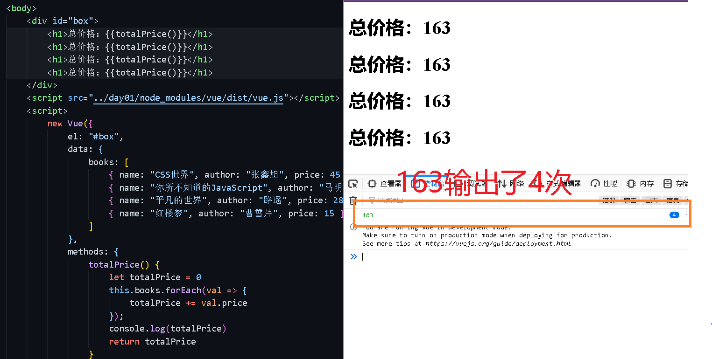
  
  用了计算属性，163只输出了一次

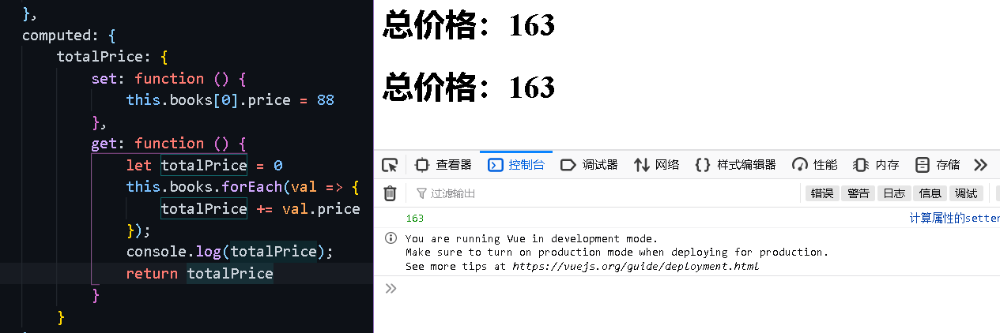

## 事件监听

在前端开发中，我们需要经常和用户交互：

- 这个时候，我们就必须监听用户发生的事件，比如点击、拖拽、键盘事件等等
- 在Vue中，使用v-on指令监听事件

v-on介绍：

- 作用：绑定事件监听器
- 缩写：@
- 参数：event

### v-on的基本使用和语法糖

```vue
<div id="app">
    <h1>{{counter}}</h1>
    <button v-on:click="increment">+</button>
    <button v-on:click="decrement">-</button>
</div>
<script src="./vue.js"></script>
<script>
	const app=new Vue({
        el:"#app",
        data:{
            couter:0
        },
        methods:{
            increment(){
                this.counter++
            },
            decrement(){
                this.counter--
            }
        }
    })
</script>
<!--v-on:click的语法糖写法-->
@click
```

### v-on的参数问题

当通过methods中定义方法，以供@click调用时，需要注意参数问题：

情况一：如果该方法不需要额外参数，那么方法后的()可以不添加，但是注意**如果方法本身有一个形参，那么会默认将原生事件的event参数传递进去**

情况二：如果需要同时传入某个参数，同时需要event时，可以通过$event传入事件

代码示例如下：

```vue
<div id="box">
        <button @click="fn1">按钮1</button> <!--点击输出btn1，不需要传参数-->
        <button @click="fn2">按钮2</button> <!--调用方法没有加括号，方法本身有形参，点击输出click事件对象-->
        <button @click="fn3()">按钮3</button><!--调用方法加了括号没传实参，方法本身有形参，点击输出undefined-->
    	<button @click="fn4($event)">按钮4</button><!--调用方法加了括号想让他输出事件对象，方法本身有形参，就传一个$event作为形参-->
        <button @click="fn5('马明明')">按钮4</button><!--调用方法加了括号并传了实参，方法本身有形参，点击输出传递的实参-->
        <button @click="fn6('马明明',$event)">按钮5</button><!--如果既想要输出实参，又想让它输出事件对象，就多传一个$event参数-->
    </div>
    <script src="../day01/node_modules/vue/dist/vue.js"></script>
    <script>
        new Vue({
            el: "#box",
            methods:{
                fn1(){
                    console.log("btn1")//输出btn1
                },
                fn2(name){
                    console.log(name)//输出click事件对象
                },
                fn3(name){
                    console.log(name)//输出undefined
                },
                fn4(name){
                    console.log(name)//s
                }
                fn5(name){
                    console.log(name)//输出"马明明"
                },
                fn6(name,event){
                    console.log(name,event)//输出"马明明"和click事件对象
                }
            }
        })
    </script>
```

### v-on的修饰符

@事件名.事件修饰符1.事件修饰符2='事件处理函数'

在某些情况下，我们拿到event的目的可能是进行一些事件处理。

Vue提供了修饰符来帮助我们方便的处理一些事件：

- .stop -调用event.stopPropagation()。作用：阻止事件冒泡

  ```vue
  <div class="father" @click='father'>
      <div class="son" @click.stop='son'>
          <div class="sonson" @click.stop='sonson'>
          </div>
      </div>
  </div>
  sonson(e){
  console.log('点击了sonson的盒子');
  // 原生的阻止事件冒泡
  // e.stopPropagation()
  }
  ```

- .prevent -调用event.preventDefault()。作用：阻止事件的默认行为

  ```vue
  <div class="sonson" @click.stop='sonson'>
      <a href="http://baidu.com" @click.prevent.stop='jump'>百度跳转</a>
  </div>
  ```

- .{keyCode|keyAlias} -只当事件是从特定键触发时才触发回调

  ```vue
  <input type="text" @keyUp.enter='up'>
  <input type="text" @keyUp.up='up'>
  <input type="text" @keyUp.delete='up'>
  <input type="text" @keyUp.87='up'>
  ```

- .native -监听组件根元素的原生事件

- .once -只触发一次回调

  ```vue
  <div class="son" @click.self.once='son'>
      <div class="sonson" @click='sonson'>
          <a href="http://baidu.com" @click='jump'>百度跳转</a>
      </div>
  </div>
  ```

- .self -只有触发源是自身时事件才会被触发

  ```vue
  <div class="son" @click.self='son'>
      <div class="sonson" @click='sonson'>
          <a href="http://baidu.com" @click='jump'>百度跳转</a>
      </div>
  </div>
  ```

- .capture -事件在冒泡阶段被触发

  ```vue
  <!--依次输出：father、son、grandSon-->
  <div id="box">
      <div class="father" @click.capture="father">
          father
          <div class="son" @click.capture="son">
              son
              <div class="grandSon" @click.capture="grandSon">
                  grandSon
              </div>
          </div>
      </div>
  </div>
  <script src="../day01/node_modules/vue/dist/vue.js"></script>
  <script>
      new Vue({
          el:"#box",
          methods:{
              father(){
                  console.log("father")
              },
              son(){
                  console.log("son")
              },
              grandSon(){
                  console.log("grandSon")
              }
          }
      })
  </script>
  ```

## 条件判断

### if/elseif/else的基本使用

```vue
<style>
        [v-cloak]{
            display: none;
        }
    </style>
</head>
<body>
    <div id="box">
        <p v-if="score>90" v-cloak>{{"优秀"}}</p>
        <p v-else-if="score>80" v-cloak>{{"良好"}}</p>
        <p v-else v-cloak>{{"也就那样吧"}}</p>
    </div>
    <script src="../day01/node_modules/vue/dist/vue.js"></script>
    <script>
        new Vue({
            el:"#box",
            data:{
                score:81
            }
        })
    </script>
</body>
```

### 切换登录方式案例

```vue
<div id="box">
    <div v-if="isMail">
        <label for="email">邮箱登录</label>
        <input type="text" id='email'>
    </div>
    <div v-else>
        <label for="tel">手机号登录</label>
        <input type="text" id="tel">
    </div>
    <button @click="isMail=!isMail">切换登录方式</button>
</div>
<script src="../day01/node_modules/vue/dist/vue.js"></script>
<script>
    new Vue({
        el: "#box",
        data: {
            isMail: true
        }
    })
</script>
```

### 切换登录方式案例存在的问题

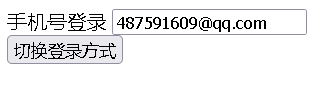

- 如果我们在有输入内容的情况下，切换了类型，我们会发现文字依然显示之前输入的内容
- 但是按道理来讲，我们应该切换到另外一个input元素中了
- 在另一个input元素中，我们并没有输入内容

- **为什么会出现这个问题呢？**

问题解答：

- 这是因为Vue在进行DOM渲染时，出于性能考虑，会尽可能的复用已经存在的元素，而不是重新创建新的元素
- 在上面的案例中，Vue内部会发现原来的input元素不再使用，直接作为else中的input来使用了

解决方案：

- 如果我们不希望Vue出现类似重复利用的问题，可以给对应的input添加key

- 并且我们要保证key的不同

  ```vue
  <input type="text" id='email' key="email">
  <input type="text" id="tel" key="tel">
  ```

  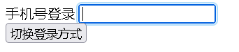

## v-show

v-show的用法和v-if非常相似，也用于决定一个元素是否渲染

v-if和v-show对比：v-if和v-show都可以决定一个元素是否渲染，那么开发中我们如何选择呢？

- v-if当条件为false时，压根不会有对应的元素在DOM里面

- v-show当条件为false时，仅仅是将元素的display属性设置为none而已

- v-if是懒加载的形式,初次渲染时如果为假就不加载节点.  v-show初次加载时无论为真为假都会加载节点

  ```vue
  <div id="box">
      <div v-show="false">哈哈啊哈</div>
  </div>
  <script src="../day01/node_modules/vue/dist/vue.js"></script>
  <script>
      new Vue({
          el:"#box"
      })
  </script>
  ```

  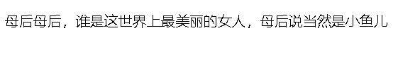

开发中如何选择呢？

- 当需要在显示与隐藏之间频繁切换时，选择v-show
- 当只有一次切换时，选择v-if

## v-for

当我们有一组数据需要进行渲染时，我们就可以使用v-for来完成

- v-for的语法类似于JavaScript的for循环

### v-for遍历数组

```vue
<div id="box">
    <ul>
        <li v-for="(movie,index) in movies">{{index+1}}.{{movie}}</li>
    </ul>
</div>
<script src="../day01/node_modules/vue/dist/vue.js"></script>
<script>
    new Vue({
        el:"#box",
        data:{
            movies:['终结者','侏罗纪世界','十二生肖','黑猫警长','龙门飞甲']
        }
    })
</script>
```

### v-for遍历对象

```vue
<div id="box">
    <ul>
        <li v-for="(val,key,index) in movies">{{index+1}}.{{key}}:{{val}}</li>
    </ul>
</div>
<script src="../day01/node_modules/vue/dist/vue.js"></script>
<script>
    new Vue({
        el:"#box",
        data:{
            movies:{
                name:"终结者",
                actor:["琳达·汉米尔顿","施瓦辛格"],
                director:"卡梅隆"
            }
        }
    })
</script>
```

### v-for绑定和不绑定key的区别

官方推荐我们在使用v-for时，给对应的元素或者组件添加上一个:key属性

为什么需要这个key属性呢

源码中有这样一段话，有一个sameVnode函数，如下：

```js
function sameVnode (a, b) {
  return (
    a.key === b.key && a.tag === b.tag
  )
}
```

也就是说，判断两个节点是否为同一个节点(也就是是否可复用)，标准是key相同且tag相同。以下图的改变为例

- 这个其实和Vue的虚拟DOM的Diff算法(difference的缩写)有关系

首先讲一下diff算法的处理方法，对操作前后的dom树同一层的节点进行对比，一层一层对比，如下图：

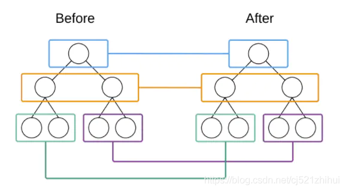

举个栗子：当某一层有很多相同的节点时，也就是列表节点时，我们希望插入一个新的节点


我们希望在B和C之间插入一个F，Diff算法默认执行起来是这样的：把C更新成F，D更新成C，E更新成D，最后再插入E，是不是很没有效率？

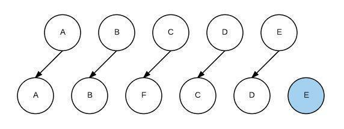

所以我们需要使用key来给每个节点做一个唯一标识，Diff算法就可以正确的识别此节点，找到正确的位置区插入新的节点。

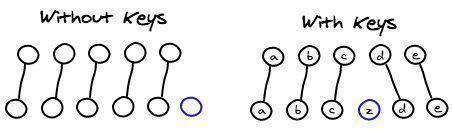

vue中列表循环需加:key="唯一标识" 唯一标识可以是item里面id、item名等，因为vue组件高度复用增加Key可以标识组件的唯一性，为了更好地区别各个组件 key的作用主要是为了高效的更新虚拟DOM。

## filters过滤器

filters: 过滤器., 对数据在输出之前做出过滤处理,输出处理之后的结构

- 过滤器不会改变真正的data，而只是改变渲染结果，并返回过滤后的版本
- 过滤器不能替代methods、computed或watch

### 全局过滤器

声明一个全局过滤器：

```js
// 定义一个Vue全局的过滤器，名字叫做  msgFormat
Vue.filter('msgFormat',function(msg,arg,arg2){
    // 字符串的 replace 方法，第一个参数，除了可写一个 字符串 之外，还可以定义一个正则
    return msg.replace(/魔镜/g,arg + arg2)
})

Vue.filter('test',function(msg){
    return msg + '======='
})

var vm = new Vue({
    el:'#app',
    data:{
        msg:'魔镜魔镜，谁是这世界上最美丽的女人，魔镜说当然是小鱼儿'
    },
})
```

使用这个过滤器：

```vue
<div id="app">
    <!-- 可以调用多个过滤器 -->
    <p>{{ msg | msgFormat('母后','123') | test}}</p>
</div>
```


### 局部过滤器

声明一个局部过滤器：

```js
var vm = new Vue({
    el:'#app',
    data:{
        msg:'魔镜魔镜，谁是这世界上最美丽的女人，魔镜说当然是小鱼儿'
    },
    filters:{
        msgFormat(msg){
            return msg.replace(/魔镜/g,"母后")
        }
    }
})
```

使用这个过滤器：

```vue
<div id="app">
    <p>{{msg|msgFormat(msg)}}</p>
</div>
```


## v-model

v-model能够实现双向绑定


### v-model的使用

```vue
<div id="box">
    <input type="text" v-model="message">
    <p>{{message}}</p>
</div>
<script src="../day01/node_modules/vue/dist/vue.js"></script>
<script>
    new Vue({
        el:"#box",
        data:{
            message:"我和我的家乡"
        }
    })
</script>
```

### v-model的原理

v-model其实是一个语法糖，它的背后本质上是包含两个操作：

- v-bind绑定一个value属性
- v-on指令给当前元素绑定input事件

上面的代码等价于下面的代码：

```vue
<!--写法一：-->
<div id="box">
    <input type="text" :value="message" v-on:input="change"><!--input是表单的一个事件，输入内容会触发该事件-->
    <p>{{message}}</p>
</div>
<script src="../day01/node_modules/vue/dist/vue.js"></script>
<script>
    new Vue({
        el: "#box",
        data: {
            message: "我和我的家乡"
        },
        methods: {
            change(event) {//获取input的事件对象
                this.message = event.target.value 
            }
        }
    })
</script>
<!--简化写法-->
<div id="box">
    <input type="text" :value="message" v-on:input="message=$event.target.value"><!--$event用于获取原生事件对象-->
    <p>{{message}}</p>
</div>
<script src="../day01/node_modules/vue/dist/vue.js"></script>
<script>
    new Vue({
        el: "#box",
        data: {
            message: "我和我的家乡"
        }
    })
</script>>
```

### v-model结合radio使用

加了v-model="sex"，name="sex"可以不用加

```vue
<div id="box">
    <input type="radio"  value="男" v-model="sex">男
    <input type="radio"  value="女" v-model="sex">女
    <p>您选择的性别是：{{sex}}</p>
</div>
<script src="..//day01/node_modules/vue/dist/vue.js"></script>
<script>
    new Vue({
        el:"#box",
        data:{
            sex:"男"
        }
    })
</script>
```

### v-model结合checkbox使用

复选框分为两种情况：单个复选框和多个复选框

单个复选框：绑定的是布尔值；多个复选框：绑定的是数组

具体原理不详，搜到一个不太靠谱但又有点道理的解释，尤其是关于传入字符串会转化为布尔值的解释我觉得不太靠谱，仅供参考：

- checkbox和普通input一样，点击勾选其实就是输入value,而输入value会改变checked属性,所以会选中 当v-model对应“字符串”时会解析“字符串”为布尔值，v-model对应有值或是true，checkbox都会选中
- 当v-model对应“数组”时有勾表示已选中，相当于赋值给，相当于有value，v-model对应value,没有value属性时，点勾相当于将('null')赋值给value==>v-model('null'为字符串),有value属性时,点勾相当于将(value)赋值给value==>v-model,注意数据是双向绑定的,所以数组里的值对应着checkbox的value==>v-model

```vue
<div id="box">
        <label>
            <input type="checkbox" value="篮球" v-model="hobbies">篮球
        </label>
        <label>
            <input type="checkbox" value="足球" v-model="hobbies">足球
        </label>
        <label>
            <input type="checkbox" value="羽毛球" v-model="hobbies">羽毛球
        </label>
        <label>
            <input type="checkbox" value="排球" v-model="hobbies">排球
        </label>
        <label>
            <input type="checkbox" value="高尔夫球" v-model="hobbies">高尔夫球
        </label>
        <p>你选择的是：{{hobbies.join(" ")}}</p>
        <label>
            <input type="checkbox" v-model="isAgree" value="同意协议">
            同意协议
        </label>
        <p>{{isAgree}}</p>
    </div>
    <script src="../day01/node_modules/vue/dist/vue.js"></script>
    <script>
        new Vue({
            el: "#box",
            data: {
                isAgree:true,//单个复选框绑定到布尔值
                hobbies:[] //多个复选框绑定到数组
            }
        })
</script>
```

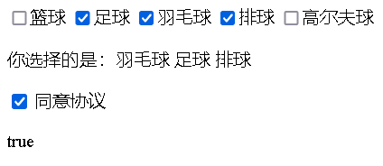

### v-model结合select使用

这个也分为两种情况：单选和多选

代码示例：

```vue
<div id="app">
    <select name="fruits" id="" v-model="fruit" v-model="fruits" multiple> 
        <option value="香蕉">香蕉</option>
        <option value="猕猴桃">猕猴桃</option>
        <option value="苹果">苹果</option>
        <option value="菠萝">菠萝</option>
        <option value="柿子">柿子</option>
    </select>
    <p>你选择的水果是：{{fruit}}</p>
</div>
<script src="../day01/node_modules/vue/dist/vue.js"></script>
<script>
    new Vue({
        el:"#app",
        data:{
            fruit:"菠萝",
        }
    })
</script>
```

设置为单选时，绑定的是一个字符串：

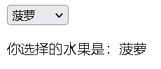

添加mutiple属性设置为多选时，自动绑定为一个数组，好神奇：

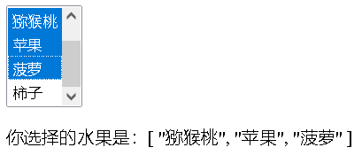

### v-model的修饰符

lazy修饰符：

- 默认情况下，v-model默认是在input事件中同步输入框的数据的

- 也就是说，一旦有数据发生改变对应的data中的数据就会自动发生改变

- lazy修饰符可以让数据在失去焦点或者回车时才会更新

  ```vue
  <label>
      请输入用户名：<input type="text" v-model.lazy="username">
  </label>
  <p>你输入的内容是：{{username}}</p>
  ```

number修饰符：

- 默认情况下，在输入框中无论我们输入的是数字还是字母，都会被当作字符串类型进行处理
- 但是如果我们希望处理的是数字类型，那么最好直接将内容当作数字处理
- number修饰符可以让在输入框中输入的内容自动转换成数字类型

​    **加修饰符之前是这样的**


​	**加了修饰符是这样的**

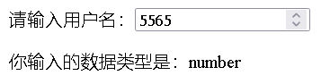

trim修饰符：

- 如果输入的内容首尾有很多空格，通常我们希望将其去除

- trim修饰符可以过滤内容左右两边的空格

  **加修饰符之前是这样的**

  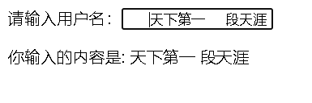

  **加了修饰符是这样的**

  亲测跟没加修饰符一样，卵用没有

## Vue实例的生命周期函数

vue实例的生命周期：从Vue实例创建、运行到销毁期间，总是伴随着各种各样的事件，这些事件统称为生命周期

生命周期钩子：就是生命周期事件的别名而已

生命周期钩子=生命周期函数=生命周期事件

生命周期函数的主要分类

<table>
    <tr>
    	<th>何时触发</th>
        <th>生命周期钩子</th>
    </tr>
    <tr>
    	<td rowspan="4">初始化时依次触发</td>
        <td>beforeCreate</td>
    </tr>
    <tr>
        <td>created</td>
    </tr>
    <tr>
        <td>beforeMount</td>
    </tr>
    <tr>
        <td>mounted</td>
    </tr>
    <tr>
        <td rowspan="2">页面元素更新时触发</td>
        <td>beforeUpdate</td>
    </tr>
    <tr>
        <td>updated</td>
    </tr>
    <tr>
        <td>组件激活时调用</td>
        <td>activated</td>
    </tr>
    <tr>
        <td>组件停用时调用</td>
        <td>deactivated</td>
    </tr>
    <tr>
        <td rowspan="2">vue实例销毁时依次触发执行</td>
        <td>beforeDestory</td>
    </tr>
    <tr>
        <td>destoryed</td>
    </tr>
</table>

### 创建期间的生命周期函数

- beforeCreate:实例刚刚在内存中被创建出来，此时，还没有初始化好data和methods属性
- created：实例已经在内存中创建完成，此时data和methods已经创建完成，此时还没有开始编译模板。我们可以在这里进行Ajax请求
- beforeMount：此时已经完成了模板的编译，但是还没有挂载到页面上
- mounted：此时，已经将编译好的模板，挂载到了页面指定的容器中显示（mounted之后，表示**真实的DOM已经渲染完成，可以操作DOM了**） 

代码示例：

```vue
<!--这个div区域是MVVM中的View-->
    <div id="app">
    </div>
    <script src="../day01/node_modules/vue/dist/vue.js"></script>
    <script>
        new Vue({
            el:"#app",
            data:{
                name:"马明明",
                age:18
            },
            //这是第1个生命周期函数，表示实例完全被创建出来之前会执行它
            beforeCreate(){
                //在beforeCreate生命周期函数执行的时候，data和methods中的数据都还没有被初始化
                console.log("01-beforeCreate",this.name,this.age);// 01-beforeCreate undefined undefined
            },
            //这是第2个生命周期函数
            created(){
                //如果要调用methods中的方法，或者操作data中的数据，最早只能在created中操作
                console.log("02-created",this.name,this.age);// 02-created 马明明 18
            },
            //这是第3个生命周期函数，表示模板已经在内存中编辑完成了，但是尚未把模板渲染到页面中
            beforeMount(){
                //在beforeMount执行的时候，页面中的元素，还没有被真正替换过来，只是之前写的一些模板字符串
                console.log("03-beforeMount",this.name,this.age);// 03-beforeMount 马明明 18
            },
            //这是第4个生命周期函数，表示内存中的模板，已经真实挂载到了页面中，用户已经可以看到渲染好的页面了
            mounted(){
                //mounted是实例创建期间的最后一个生命周期函数，当执行完mounted就表示实例已经被完全创建好了
                //此时，如果没有其它操作的话，这个实例就静静的躺在我们的内存中，一动不动
                console.log("04-mounted",this.name,this.age); // 04-mounted 马明明 18
            }
        })
    </script>
```

### 运行期间的生命周期函数

- beforeUpdate:状态更新之前执行此函数，此时data中的状态值是最新的，但是界面上显示的数据还是旧的，因为此时还没有开始重新渲染DOM节点
- updated：实例更新完毕之后调用此函数，此时data中的状态值和界面上显示的数据，都已经完成了更新，界面已经被重新渲染好了。

PS：数据发生变化时，会触发这两个方法。不过，我们一般使用watch来做。

代码示例：

```vue
<!--这个div区域就是MVVM中的View-->
<div id="app">
        <input type="button" value="点击更改flag" @click="flag=!flag">
        <h1 ref="flag">{{flag}}</h1>
    </div>
    <script src="../day01/node_modules/vue/dist/vue.js"></script>
    <script>
        new Vue({
            el: "#app",
            data: {
                flag: true
            },
            //接下来时运行中的两个事件
            //这时候，界面还没有被更新，但是data中的数据已经被更新了，不信你看输出结果
            beforeUpdate() {
                console.log("--------05.beforeUpdate");//--------05.beforeUpdate
                console.log("data中flag的值：" + this.flag);//data中flag的值：false
                console.log("DOM节点上flag的值：" + this.$refs.flag.innerHTML);//DOM节点上flag的值：true
            },
            //结论：当执行beforeUpdate的时候，页面中的显示的数据，还是旧的，但是data中的数据时最新的，页面尚未和最新的数据保持同步
            updated(){
                console.log("--------06.updated");//--------06.updated
                console.log("data中flag的值："+this.flag);//data中flag的值：false
                console.log("DOM节点上flag的值："+this.$refs.flag.innerHTML);//DOM节点中flag的值：false
            }
            //结论：updated事件执行的时候，页面和data数据已经保持同步了，都是最新的
        })
    </script>
```

### 销毁期间的生命周期函数

- beforeDestroy:实例销毁之前调用。在这一步，实例仍然完全可用
- destroyed:Vue实例销毁后调用。调用后，Vue实例指示的所有东西都会解绑定，所有的事件监听器会被移除，所有的子实例也会被销毁。

PS：可以在beforeDestroy里**清除定时器，或清除事件绑定**

### 生命周期函数图解

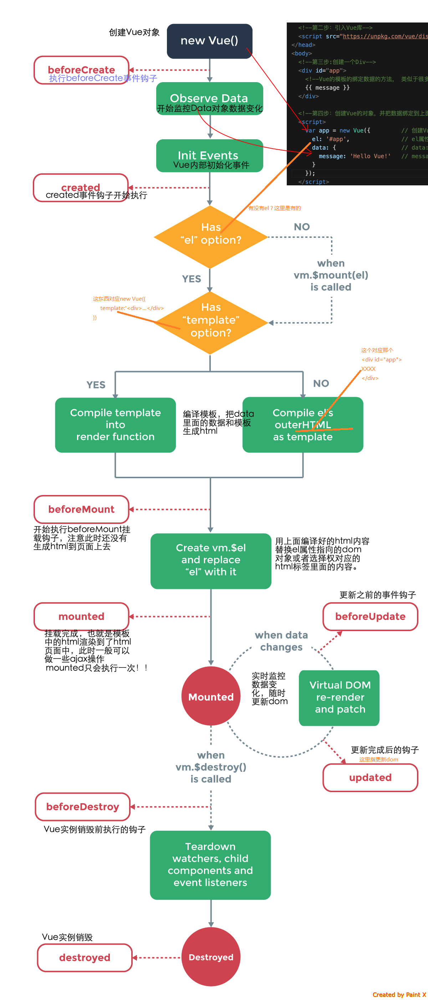

## Vue动画

动画的作用：提高用户体验，帮助用户更好的理解页面中的功能。

### 使用过渡类名实现动画

过渡类名如下：

- 动画进入：
  - v-enter：动画进入之前的**初始**状态（时间点）
  - v-enter-to：动画进入之后的**结束**状态（时间点）
  - v-enter-active：动画进入的过程中（时间段）
- 动画离开
  - v-leave：动画离开之前的**初始**状态（时间点）
  - v-leave-to：动画离开之后的**结束**状态（时间点）
  - v-leave-active：动画离开的过程中（时间段）

v-enter-to和v-leave的状态是一样的。而且一般来说，v-enter和v-leave-to的状态也是一致的。所以，我们可以把这四个状态写成两组。

案例：点击按钮，添加淡入淡出动画，让div显示/隐藏。

```vue
<style>
        .box{
            width: 200px;
            height: 200px;
            background-color: rgb(247, 203, 7);
            margin-top: 20px;
        }
        .v-enter,.v-leave-to{
            opacity: 0;
            transform: translateX(300px);
        }
        /*这个进入后、离开之前的样式可以不用写
    	.v-enter-to,.v-leave{
            opacity: 100%;
            transform: translateX(0);
        }*/
        .v-enter-active,.v-leave-active{
            transition: all 0.5s;
        }
    </style>
<body>
    <div id="app">
        <input type="button" value="淡入淡出" @click="flag=!flag">
        <!-- 需求： 点击按钮，让 div 飞入，再点击，让 div飞出 -->
        <!-- 1. 使用 transition 元素，把 需要被动画控制的元素，包裹起来 -->
        <!-- transition 元素，是 Vue 官方提供的 -->
        <transition>
            <div class="box" v-if="flag"></div>
        </transition>
    </div>
    <script src="../day01/node_modules/vue/dist/vue.js"></script>
    <script>
        //创建Vue实例，得到ViewModel
        new Vue({
            el:"#app",
            data:{
                flag:true
            }
        })
    </script>
```

### 修改过渡类名的前缀

在上一小段中，`.v-enter`、`.v-leave-to`这些过渡类名都是以`v-`开头的。这样做，会有一个局限性：假设有两个DOM元素都用`<transition>`进行了包裹，那这两个DOM元素就都具备了`v-`中所定义的动画。

那**如果我们想把两个DOM元素的动画进行分开定义**，该怎么做呢？这里，我们可以通过修改过渡类名的前缀来做。比如：

第一步：（自定义别名）

```html
    <transition name="my">
      <h6 v-if="flag2">这是一个H6</h6>
    </transition>
```

上方代码中，我们加了`name="my"`。

第二步：（我们就可以使用 `my-enter`、`.my-leave-to`这些类名了）

完整代码示例：

```vue
<style>
        .box{
            width: 200px;
            height: 200px;
            background-color: rgb(247, 203, 7);
            margin-top: 20px;
        }
        .my-enter,.my-leave-to{
            opacity: 0;
            transform: translateX(300px);
        }
        .my-enter-active,.my-leave-active{
            transition: all 0.5s;
        }
</style>
<body>
    <div id="app">
        <input type="button" value="淡入淡出" @click="flag=!flag">
        <transition name="my">
            <div class="box" v-if="flag"></div>
        </transition>
    </div>
    <script src="../day01/node_modules/vue/dist/vue.js"></script>
    <script>
        new Vue({
            el:"#app",
            data:{
                flag:true
            }
        })
    </script>
```

### 使用第三方animate.css类库实现动画

代码示例：

```vue
<div id="app">
        <input type="button" value="切换" @click="flag=!flag">
        <transition enter-active-class="animate__animated animate__backInDown" leave-active-class="animate__animated animate__backInDown">
            <h1 v-if="flag">😤</h1>
        </transition>
    </div>
    <script>
        new Vue({
            el:"#app",
            data:{
                flag:false
            }
        })
    </script>
```

上面的代码中，注意：

- `enter-active-class`和`leave-active-class`这两个类名是Vue动画里的关键词，不能写成自己**随意起**的类名。

- `animate__backInDown`这个类不能直接使用，要在前面加上`animate__animated`这个类；否则动画是不会生效的。当然，上面的代码中，我们还可以把`class = animate__animated`这个代码移到`<h1>`标签里，效果是一样的，如下：

  ```vue
  <h1 v-if="flag" class="animate__animated">😤</h1>
  ```

如果我们想给入场、出场动画统一设置持续时间，可以使用:duration来做。如下：

```vue
<transition enter-active-class="animate__zoomInDown" leave-active-class="animate__zoomOutDown" :duration="1000">
            <h1 v-if="flag" class="animate__animated">😤</h1>
</transition>
```

如果我们想给入场、出场动画分别设置持续时间，:duration的值应是一个对象，如下：

```vue
<transition enter-active-class="animate__zoomInDown" leave-active-class="animate__zoomOutDown" :duration="{enter: 1000, leave: 300 }">
            <h1 v-if="flag" class="animate__animated">😤</h1>
</transition>
```

### 钩子函数实现半场动画

只有出场动画、没有离场动画，这种就是属于半场动画。比如你把一件商品加入收藏，会出现一个动画；当再次点击收藏按钮的时候却看不到动画效果，这就说明，只有前一半才有动画。半场动画，可以使用钩子函数来实现。

**动画的钩子函数介绍**

可以在属性中声明 JavaScript 钩子函数：（这八个钩子函数可以理解成是动画的生命周期）

```vue
<transition
  v-on:before-enter="beforeEnter"
  v-on:enter="enter"
  v-on:after-enter="afterEnter"
  v-on:enter-cancelled="enterCancelled"
  v-on:before-leave="beforeLeave"
  v-on:leave="leave"
  v-on:after-leave="afterLeave"
  v-on:leave-cancelled="leaveCancelled"
>
  <!-- DOM元素 -->
</transition>
```

我们可以这样理解：上面这八个钩子函数（四个入场、四个离场），对应了八个事件，我们要紧接着在methods中定义八个函数。

如果要定义半场动画，做法是：直接在methods中写入场动画的函数，不写离场动画的函数即可。

案例：使用钩子函数模拟小球半场动画—点击按钮后，让小球进行移动，代码如下：

```vue
<div id="app" class="container">
        <button class="btn btn-success" @click="flag=!flag">快到碗里去</button>
        <transition v-on:before-enter="beforeEnter" v-on:enter="enter" v-on:after-enter="afterEnter">
            <div class="ball" v-show="flag"></div>
        </transition>  
    </div>
    <script src="../day01/node_modules/vue/dist/vue.js"></script>
    <script>
        new Vue({
            el:"#app",
            data:{
                flag:false,
            },
            methods:{
                // 注意： 动画钩子函数的第一个参数：el，表示 要执行动画的那个DOM元素，是个原生的 JS DOM对象
                // 我们可以认为 ， el 是通过 document.getElementById('') 方式获取到的原生JS DOM对象
                beforeEnter(el){
                    // beforeEnter 表示动画入场之前，此时，动画尚未开始，可以 在 beforeEnter 中，设置元素开始动画之前的起始样式
                    // 设置小球开始动画之前的 起始位置
                    el.style.transform="translate(30px,0)"
                },
                enter(el,done){
                    //el.offsetWidth 这句话，没有实际的作用，但是，如果不写，出不来动画效果。可以认为 el.offsetWidth 会强制动画刷新
                    el.offsetWidth,
                    // enter 表示动画 开始之后的样式，这里，可以设置小球完成动画之后的，结束状态
                    el.style.transform="translate(150px,300px)"//让小球从（0，0）移动到 (150px, 300px)
                    el.style.transition = 'all 0.6s ease'
                    //这里的 done， 起始就是 afterEnter 这个函数，也就是说：done 是 afterEnter 函数的引用
                    done()
                },
                afterEnter() {
                    // 动画完成之后，会调用 afterEnter
                    // console.log('ok')
                    // 动画结束后，让小球消失（直接让 flag 取反即可）
                    this.flag = !this.flag  // 因为最开始的时候，小球就是处于消失的状态，这行代码可以让小球的动画重新开始
                }
            }
        })
    </script>
```

### 使用transition-group元素实现列表动画

现在的场景是：在一个`<ul>`列表中，如果我想给**指定的某个**`li`添加动画效果，该怎么做呢？（需要声明的是，这些`li`是用v-for循环进行遍历的）

如果我们用`<transition>`把`li`包裹起来，就会让所有的`li`都具备了动画，这显然是不可取的。

那该怎么做呢？这里我们就可以用`transition-group`进行包裹。

```vue
<style>
    li {
        border: 1px dashed #999;
        margin-bottom: 5px;
        line-height: 35px;
        padding-left: 5px;
        font-size: 12px;
        width: 100%;
        list-style: none;
    }

    li:hover {
        background-color: hotpink;
        transition: all 0.8s ease;
        /*鼠标悬停时，出现背景色。让这个背景色的出现，也加一个淡入的动画*/
    }

    .v-enter,
    .v-leave-to {
        opacity: 0;
        transform: translateY(80px);
    }

    .v-enter-active,
    .v-leave-active {
        transition: all 0.6s ease;
    }
    input{
        margin-top: 20px;
        margin-bottom: 50px;
    }
</style>

<body>
    <div id="app" class="container">
        <label>
            ID:
            <input type="text" v-model="id">
        </label>
        <label>
            NAME:
            <input type="text" v-model="name">
        </label>
        <button @click="add" class="btn btn-info">添加</button>
        <!-- 在实现列表过渡的时候，如果需要过渡的元素，是通过 v-for 循环渲染出来的，不能使用 transition 包裹，需要使用 transitionGroup -->
        <!-- 如果要为 v-for 循环创建的元素设置动画，必须为每一个 元素 设置 :key 属性 -->
        <!-- 给 ransition-group 添加 appear 属性，实现页面刚展示出来时候，入场时候就出现动画效果 -->
        <!-- 通过 为 transition-group 元素，设置 tag 属性，指定 transition-group 渲染为指定的元素，如果不指定 tag 属性，默认，渲染为 span 标签 -->
            <transition-group appear tag="ul">
                <li v-for="(item,index) in users" :key="item.id" @click="del(index)">{{item.id}} {{item.name}}</li>
            </transition-group>
    </div>
    <script src="../day01/node_modules/vue/dist/vue.js"></script>
    <script>
        new Vue({
            el: "#app",
            id: "",
            name: "",
            data:{
                users:[{
                    id:"1",
                    name:"马化腾"
                }]
            },
            methods: {
                add() {
                    let info = {};
                    info.id = this.id,
                    info.name = this.name,
                    this.users.push(info)
                },
                del(index){
                    this.users.splice(index,1)
                }
            }
        })
    </script>
```

我们发现，当我删除第2个item时，**第3、第4个item在往上移动的过程比会较突兀**。为了改进这个地方，我们可以给`.v-move`、`.v-leave-active`加一些动画属性。

```js
 /*  .v-move 和 .v-leave-active 配合使用，能够实现列表后续的元素，渐渐地漂上来的效果 */
.v-move {
transition: all 0.6s ease;
}

.v-leave-active {
position: absolute;
}
```

## 组件化

组件化是Vue中的重要思想

- 他提供了一种抽象，让我们可以开发出一个个独立可复用的小组件来构造我们的应用
- 任何的应用都会被抽象成一棵组件树

组件化思想的应用

- 有了组件化的思想，我们在之后的开发中就要充分的利用它
- 尽可能的将页面拆分成一个个小的、可复用的组件
- 这样让我们的代码更加方便组织和管理，并且扩展性也更强

### 什么是组件

组件的出现，就是为了拆分Vue实例的代码量的，能够让我们以不同的组件，来划分不同的功能模块，将来我们需要什么样的功能，就可以去调用对应的组件即可。

### 组件化和模块化的区别

- 模块化：是从代码逻辑的角度进行划分的；方便代码分层开发，保证每个功能模块的职能单一
- 组件化：是从UI界面的角度进行划分的；前端的组件化，方便UI组件的重用

### 全局组件的定义和注册

写法一：使用Vue.extend方法定义组件，使用 Vue.component方法注册组件。

代码举例：

```vue
<div id="box">
    <!--第三步：使用组件-->
    <account></account>
</div>
<script src="../day01/node_modules/vue/dist/vue.js"></script>
<script>
    //第一步：使用Vue.extend定义组件
    var myAccount=Vue.extend({
        template:'<div><h1>登录页面</h1><h2>注册页面</h2></div>'
    });
    //第二步：使用Vue.component注册组件
    Vue.component("account",myAccount)//第一个参数是组件名称，第二个参数是模板对象
    new Vue({
        el:"#box",
    })
</script>
```

代码截图：

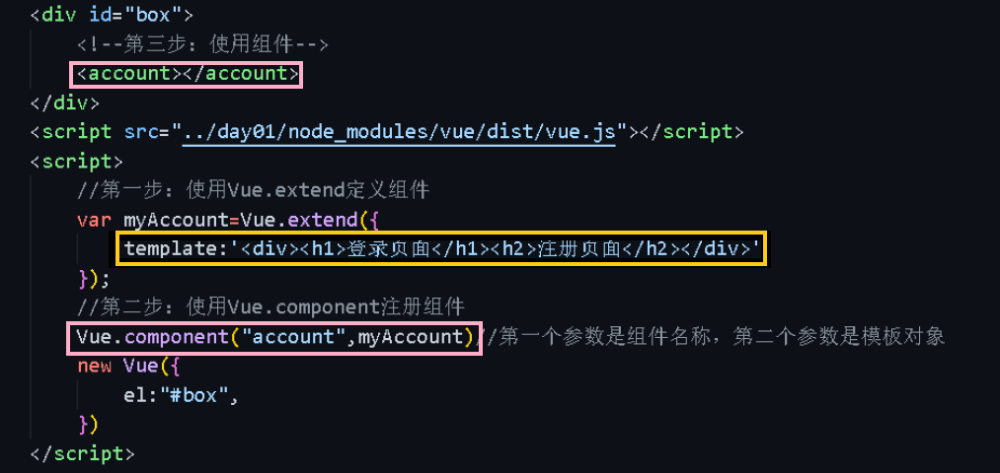

注意事项：

- 粉色框部分，Vue.component()的第一个参数尽量跟使用组件时用的标签名保持一致，如果参数要使用驼峰命名法，那么标签名一定要改成横杆的形式才能生效，举例如下：

  ```vue
  Vue.component("myAccount",myAccount)//如果定义的时候要这样
  //那么使用的时候必须要这样才能生效
  <my-account></my-account>
  ```

- 黄色框部分，一定要用一个大的根元素（例如`<div>`）包裹起来。如果我写成下面这样，就没有预期的效果：

  ```vue
  template: '<h2>登录页面</h2> <h3>注册页面</h3>'
  ```

  结果如下：（并非预期的效果）

  

写法二：Vue.component()定义、注册组件一步到位，代码如下：

```vue
Vue.component("account",{
            template:"<div><h1>登录页面</h1><h2>注册页面</h2></div>"
        })
        new Vue({
            el:"#box"
        })
```

写法三：将组件内容定义到template标签中去。

```vue
<div id="box">
    	<!--第一步：定义组件-->
        <template id="myAccount">
            <div>
                <h1>登录页面</h1>
                <h2>注册页面</h2>
            </div>
        </template>
        <!--第三步：使用组件-->
        <my-account></my-account>
    </div>
    <script src="../day01/node_modules/vue/dist/vue.js"></script>
    <script>
        //第二步：注册组件
       Vue.component("myAccount",{
           template:"#myAccount"
       })
       new Vue({
           el:"#box"
       })
    </script>
```

### 私有组件的定义和使用

我们在上一段中定义的是**全局组件**，这样做的时候，多个Vue实例都可以使用这个组件。

我们还可以在一个Vue实例的内部定义**私有组件**，这样做的时候，只有当前这个Vue实例才可以使用这个组件。

```vue
<div id="app">
    <!--第二步：使用Vue示例内部的私有组件-->
</div>
<script>
	new Vue({
        el:"#app",
        data:{},
        components:{//定义、注册Vue实例内部的私有组件
            myLogin:{
                template:"<h1>这是私有的loin组件</h1>"
            }
        }
    })
</script>
```

当然，我们还可以把**模板的定义**存放在`<template>`标签中，这样的话，模板里的html标签就可以出现智能提示和高亮，避免出错。如下：

```vue
<!--定义模板-->
<template id="loginTmp">
	<h1>这是私有的login组件</h1>
</template>
<div id="app">
    <!--调用Vue实例内部的私有组件-->
    <my-login></my-login>
</div>
<script>
	new Vue({
        el:"#app",
        data:{},
        components:{//定义、注册Vue实例内部的私有组件
            myLogin:{
                template:"#loginTmp"
            }
        }
    })
</script>
```

### 为组件添加data和methods

既然组件是一个页面，那么，页面中可能会有一些功能要**动态展示**。因此，我们有必要为组件添加data和methods。

代码举例如下：

```vue
<!--第一步：定义组件的模板-->
<template id="myAccount">
<div>
    {{myData}}
    <a href="#">登录</a>
    <h2>登录页面</h2>
    <h3>注册页面</h3>
    </div>
</template>
<div id="box">
    <!--第三步：使用组件-->
    <account></account>
</div>
<script src="../day01/node_modules/vue/dist/vue.js"></script>
<script>
    //第二步：定义、注册组件
    Vue.component("account",{
        template:'#myAccount',
        //组件中的data
        data:function(){
            return {
                myData:"smyhvae"
            }
        },
        //组件中的method
        methods:{
            login:function(){
                alert("login操作")
            }
        }
    })
    new Vue({
        el:"#box"
    })
</script>
```

上方代码所示，我们在`account`组件中添加的data 和 methods，其**作用域**只限于`account`组件里，保证独立性。

注意，在为组件添加数据时，data不再是对象了，而是function，而且要通过 return的形式进行返回；否则，页面上是无法看到效果的。通过 function返回对象的形式来定义data，作用是：

- 上方代码中，组件`<account>`被调用了两次（不像根组件那样只能调用一次），但是每个组件里的数据 myData是**各自独立**的，不产生冲突。
- 换而言之，通过函数返回对象的目的，是为了让每个组件都有自己**独立的数据存储**，而不应该共享一套数据。

### 为什么组件的data必须是一个function

**注意**：组件是不能访问Vue实例里面的数据的，只能访问自己data里面的数据。组件对象自己也有一个data属性，只是这个data属性必须是一个函数，而且这个函数返回一个对象，对象内部保存着数据。

先来看一个栗子：

```vue
<div id="app">
        <!-- 第一次调用组件 -->
        <counter></counter>
        <hr>
        <!-- 第二次调用组件 -->
        <counter></counter>
    </div>
    <!-- 定义模板 -->
    <template id="tmpl">
        <div>
            <input type="button" value="让count加1" @click="increment">
            <h3>{{count}}</h3>
        </div>
    </template>
    <script>
        var dataObj = { count: 0 }
        // 这是一个计数器的组件, 身上有个按钮,每当点击按钮,让 data 中的 count 值 +1
        Vue.component('counter', {
            template: '#tmpl',
            data: function () {
                return dataObj //当我们return全局的dataObj的时候，子组件们会共享这个dataObj
            },
            methods: {
                increment() {
                    this.count++
                }
            }
        })
        // 创建 Vue 实例，得到 ViewModel
        var vm = new Vue({
            el: '#app',
            data: {},
            methods: {}
        });
    </script>
```

运行效果如下：


上面的例子中，将组件`<counter>`调用了两次，由于`dataObj`是**全局对象**，导致两个组件实例都可以**共享**这个`dataObj`数据。于是，我们点击任何一个组件实例的按钮，都可以让`count`数据加1。

现在问题来了，如果我们想让组件`<counter>`的两个实例去单独操作`count`数据，应该怎么做呢？我们应该修改 data中 return出去的内容：

```js
data: function () {
    // return dataObj //当我们return全局的dataObj的时候，这个dataObj是共享的
    return { count: 0 } // 【重要】return一个新开辟的对象数据
},
```

运行效果如下：


如上图所示，每当我们创建一个新的组件实例时，就会调用data函数，data函数里会return一个**新开辟**的对象数据。这样做，就可以保证每个组件实例有**独立的数据存储**。

### 组件的切换

#### 使用v-if和v-else结合flag进行切换

代码示例：登录注册切换

```vue
<template id="login">
	<div>
    	<h1>登录</h1>
    	<label>
        	用户名：<input type="text">
    	</label>
    	<label>
        	密码：<input type="text">
    	</label>
	</div>
</template>
<template id="register">
	<div>
    	<h1>注册</h1>
    	<label>
        	用户名：<input type="text">
    	</label>
    	<label>
        	密码：<input type="text">
    	</label>
    	<label>
        	手机号：<input type="tel">
    	</label>
    </div>
</template>
<div id="box">
    <p><button @click="flag=true">登录</button> <button @click="flag=false">注册</button></p>
    <my-login v-if="flag"></my-login>
    <my-register v-else></my-register>
</div>
<script src="../day01/node_modules/vue/dist/vue.js"></script>
<script>
    new Vue({
        el:"#box",
        data:{
            flag:false
        },
        components:{
            myLogin:{
                template:"#login"
            },
            myRegister:{
                template:"#register"
            }
        }
    })
</script>
```

#### 使用Vue提供的 `<component>`标签实现组件切换

```vue
    <template id="login">
        <div>
            <h1>登录</h1>
            <label>
                用户名：<input type="text">
            </label>
            <label>
                密码：<input type="text">
            </label>
        </div>
    </template>
    <template id="register">
        <div>
            <h1>注册</h1>
            <label>
                用户名：<input type="text">
            </label>
            <label>
                密码：<input type="text">
            </label>
            <label>
                手机号：<input type="tel">
            </label>
        </div>
    </template>
    <div id="box">
        <!-- 点击按钮后，设置当前的组件`curCom`为不同的值，代表着后面的component里显示不同的组件 -->
        <p><button @click="curCom='myLogin'">登录</button> <button @click="myinput='myRegister'">注册</button></p>
        <!--Vue提供了component，来展示对应名称的组件-->
        <!--component是一个占位符，:is属性，可以用来指定要展示的组件的名称-->
        <!--此处的curcom是变量，变量值为组件名称-->
        <component :is="curCom"></component>
    </div>
    <script src="../day01/node_modules/vue/dist/vue.js"></script>
    <script>
        //创建vue实例，得到ViewModel
        new Vue({
            el:"#box",
            components:{
                myLogin:{
                    template:"#login"
                },
                myRegister:{
                    template:"#register"
                }
            },
            data:{
                curCom:'myLogin' //组件名称是字符串
            }
        })
    </script>
```

## 组件通信

子组件是不能引用父组件或者Vue示例的数据的。

但是，在开发中，往往一些数据确实需要从上层传递到下层：

- 比如在一个页面中，我们从服务器请求到了很多数据
- 其中一部分数据，并非是我们整个页面的大组件来展示的，而是需要下面的子组件进行展示。
- 这个时候，并不会让子组件再次发送一个网络请求，而是直接让大组件（父组件）将数据传递给小组件（子组件）

如何进行父子组件之间的通信呢？Vue官方提到

- 通过props向子组件传递数据
- 通过事件向父组件发送消息

在真实开发中，Vue实例（根组件）和子组件的通信和父组件和子组件的通信过程是一样的。

### 父组件向子组件传值

我们可以这样理解：Vue实例就是一个**父组件**，而我们自定义的组件（包括全局组件、私有组件）就是**子组件**。

【重点】需要注意的是，子组件不能直接使用父组件中的数据。**父组件可以通过`props`属性向子组件传值**。

代码示例：

```vue
<div id="app">
        <!--第三步：父组件在引用子组件的时候，通过属性绑定(v-bind的形式)-->
        <!--把需要传递给子组件的数据以属性绑定的形式传递到子组件内部，供子组件使用-->
        <top-nav v-bind:parent-msg="msg"></top-nav>
    </div>
    <!--定义子组件的模板-->
    <template id="myTemplate">
        <div>
            <!--第二步：在子组件的模板中使用props中的属性-->
           <h1> 我是子组件，我想使用父组件中的数据{{parentMsg}}</h1>
           <h2>{{title}}</h2>
           <h2>{{content}}</h2>
        </div>
    </template>
    <script src="../day01/node_modules/vue/dist/vue.js"></script>
    <script>
        //创建Vue实例，得到ViewModel
        new Vue({
            el:"#app",
            data:{
                msg:"父组件中的数据"
            },
            components:{
                //子组件默认无法访问到父组件data中的数据和methods中的方法
                topNav:{//将子组件的名称定义为topNav
                    template:"#myTemplate",
                    //组件中所有的props中的数据都是通过父组件传递给子组件的
                    //props中的数据都是只读的无法重新赋值
                    //第一步：把父组件传递过来的数据先在props数组中定义一下，这样才能使用这个数据
                    props:["parentMsg"],
                    data(){//注意：子组件中data数据，并不是通过父组件传递过来的，而是子组件自身私有的，比如：子组件通过Ajax，请求回来的数据，都可以放到data身上，data上的数据都是可读可写的
                        return {
                            title:"子组件的私有数据title",
                            content:"子组件的私有数据content"
                        }
                    },
                    methods:{
                        change(){
                            this.parentMsg="被修改了"//虽然显示是修改了，但是会报错
                        }
                    }
                }
            }
        })
    </script>
```

**总结**：

- 父组件给子组件传值步骤：
  - 在子组件的props属性中声明父组件传递过来的数据
  - 定义子组件的模板时，使用props中的属性
  - 父组件在引用子组件时，进行属性绑定

- 子组件中，data中的数据和props中的数据的区别：
  - 子组件中的 data 数据，并不是通过 父组件传递过来的，而是子组件自身私有的，比如： 子组件通过 Ajax ，请求回来的数据，都可以放到 data 身上。props 中的数据，都是通过 父组件传递给子组件的。
  - data中的数据是可读可写的；props中的属性只是可读的，无法重新赋值，重新赋值会报错（也就是说，子组件不要直接去修改父组件中的数据）。

### props校验

props是单词properties的缩写形式。

- props可以是数据或者对象形式
- props 可以对接收到的数据添加校验
  - type:  数据类型校验   String|Number|Object|...
  - required:  非空校验  true|false
  - default(){return }  设置默认值（除了数组和对象，其他数据类型可以直接采用`default:数据`这种写法）
  - validator(val){return 校验规则}   自定义校验规则

```vue
<!--props属性接收外部输入数据，有两种形式
	数组形式：接收多个数据
	props:['val','money']

	对象形式，可以对接收到的数据做校验
	校验失败不影响视图的显示，只会在控制台报校验失败的错误
        1- type:String,Number,Object,...
        2- required:非空校验 true||false
        3- default(){return} 设置默认值
        4- validator(){return 校验规则条件} 自定义校验规则
-->
<div id="app">
        <son v-bind:dad-name="name" v-bind:my-money="money"></son>
    </div>
    <template id="sonTem">
        <div>
            <h1>我叫约翰盖茨，我的父亲是{{dadName}}</h1>
            <h2>他留给我的财产高达{{myMoney}}美金</h2>
        </div>
    </template>
    <script src="../day01/node_modules/vue/dist/vue.js"></script>
    <script>
        new Vue({
            el: "#app",
            data: {
                name: "Bill Gates",
                money: 20000000000
            },
            components: {
                son: {
                    template: "#sonTem",
                    props: {
                        myMoney: {
                            type: Number,
                            validator(val) {
                                return val > 1000000
                            }
                        },
                        dadName: {
                            type: String,
                            default: "比尔盖茨",
                            required: true,
                        }
                    }
                }
            }
        })
    </script>
```

### 父组件向子组件传递方法

> 父组件通过事件绑定机制，将父组件的方法传递给子组件

```vue
<div id="app">
    <!--父组件向子组件传递方法，是通过事件绑定机制：v-on。当我们自定义了一个事件属性parent-say(这个地方不能用驼峰命名)之后，那么，子组件就能够通过emit来调用传递进去这个方法了-->
    <!--第一步：意思是说，say是父组件的方法名，parent-say是自定义的事件属性，稍后要在子组件中用到-->
        <son :dad-name="name" :dad-money="money"  @parent-say="say"></son>
    </div>
<!--定义子组件的模板-->
    <template id="sonTem">
<!--第二步：按照正常的写法，点击按钮，调用子组件的方法-->
        <div>
            <h1 @click="childClick">我的父亲是{{dadName}},他给我留了{{dadMoney}}美金</h1>
        </div>
    </template>
    <script src="../day01/node_modules/vue/dist/vue.js"></script>
    <script>
        //创建Vue实例，得到ViewModel
        new Vue({
            el: "#app",
            data: {
                //父组件的数据
                name: "Buffet",
                money: 100000000
            },
            methods: {
                say() {//定义父组件的say方法
                    console.log('我实现了父亲的人生理想~~')
                }
            },
            components: {
                son: {//将子组件的名称定义为son
                    template:"#sonTem",
                    props: {//从父组件传递过来的数据保存在这里
                        dadName: {
                            default: "沃伦·巴菲特",
                            type: String
                        },
                        dadMoney: {
                            type: Number,
                            required: true
                        }
                    },
                    methods: {
                        childClick(){
                            //当点击子组件的按钮时，如何拿到父组件传递过来的方法，并调用这个方法
                            //emit英文原意：触发、调用、发射，意思是触发父组件的方法
                            //第三步：在子组件的方法中，通过emit触发父组件的方法
                            this.$emit("parent-say")
                        }
                    }
                }
            }
        })
    </script>
```

### 子组件向父组件传值

示例代码1：(将子组件中的常量传递给父组件)

```vue
<div id="app">
        <component1 @parent-show='show'></component1>
    </div>
    <!-- 定义子组件的模板 -->
    <template id="myTemplate">
        <h2 @click="childClick">我是子组件，点击调用父组件的方法</h2>
    </template>
    <script>
        // 创建 Vue 实例，得到 ViewModel
        var vm = new Vue({
            el: '#app',
            data: { //父组件的data
                // msg: '父组件中的数据'
            },
            methods: { // 定义父组件的方法
                show: function (arg1, arg2) { //【第二步】父组件里放两个参数，这个两个参数就代表着子组件中的`child 123`、`child 789`
                    console.log('父组件提供的方法');
                    console.log('打印子组件传递过来的参数。参数一：' + arg1 + '，参数二：'+ arg2);
                }
            },
            components: {
                component1: { //将子组件的名称定义为 component1
                    template: '#myTemplate',
                    data() { // 子组件的data
                        return {
                            // content: '子组件私有的数据 content'
                        }
                    },
                    props: [''],
                    directives: {},
                    filters: {},
                    components: {},
                    methods: {
                        childClick() {
                            // 子组件如果要给父组件传递参数，在触发 emit 的时候，通过参数的形式带出去就可以了
                            // 【第一步】在子组件里，我们带两个参数出去，传给父组件
                            this.$emit('parent-show', 'child 123', 'child 789');
                        }
                    }
                }
            }
        });
    </script>
```

示例代码2：(将子组件中的data数据传递给父组件，存放到父组件的data中)

> 在上方代码的基础上做改进。

```vue
<div id="app">
        <component1 @parent-show='show'></component1>
    </div>
    <!-- 定义子组件的模板 -->
    <template id="myTemplate">
        <h2 @click="childClick">我是子组件，点击调用父组件的方法</h2>
    </template>
    <script>
        // 创建 Vue 实例，得到 ViewModel
        var vm = new Vue({
            el: '#app',
            data: { //父组件的data
                parentData: null
            },
            methods: { // 定义父组件的方法
                show: function (arg) { //【第二步】父组件里放参数，这个参数就代表着子组件中的 child.data
                    console.log('父组件提供的方法');
                    this.parentData = arg; //将参数arg传递给父组件的data，也就达到了目的：子组件传递数据，赋值给父组件
                    console.log('打印父组件的数据（这是子组件传过来的）：'+ JSON.stringify(this.parentData));
                }
            },
            components: {
                component1: { //将子组件的名称定义为 component1
                    template: '#myTemplate',
                    data() { // 子组件的data
                        return {
                            childData: { //定义自组件的数据
                                name: 'smyhvae',
                                age: 26
                            }
                        }
                    },
                    props: [''],
                    directives: {},
                    filters: {},
                    components: {},
                    methods: {
                        childClick() {
                            // 子组件如果要给父组件传递参数，在触发 emit 的时候，通过参数的形式带出去就可以了
                            // 【第一步】在子组件里，通过传参的形式，把子组件的data，传给父组件
                            this.$emit('parent-show', this.childData);
                        }
                    }
                }
            }
        });
    </script>
```

案例：给父组件传递点击的按钮是哪个

```vue
<div id="app">
        <son @childclick="showTarget"></son>
    </div>
    <template id="nav">
        <div>
            <button v-for="item in navData" @click="sendData" :value="item">{{item}}</button>
        </div>
    </template>
    <script src="../day01/node_modules/vue/dist/vue.js"></script>
    <script>
        new Vue({
            el: "#app",
            data: {
                name: "马明明",
                age: 18,
                target:""
            },
            methods: {
                showTarget(arg) {
                    this.target = arg
                    console.log(this.target)
                }
            },
            components: {
                son: {
                    template: "#nav",
                    data() {
                        return {
                            navData: ["首页", "关于我们", "今日特价", "双十一活动", "秒杀抢购"]
                        }
                    },
                    methods: {
                        sendData(ev) {
                            this.$emit("childclick", ev.target.value)
                        }
                    }
                }
            }
        })
    </script>
```

案例：组件通信结合数据绑定

```vue
    <div id="app">
        <son :s-num1="num1" :s-num2="num2" @num1change="changeNum1" @num2change="changeNum2"></son>
    </div>
    <template id="son">
        <div>
            <input type="text" v-bind:value="dNum1" @input="inputNum1" >
            <h1>props:{{sNum1}}</h1>
            <h1>data:{{dNum1}}</h1>
            <input type="text" v-bind:value="dNum2" @input="inputNum2" >
            <h1>props:{{sNum2}}</h1>
            <h1>data:{{dNum2}}</h1>
        </div>
    </template>
    <script src="../day01/node_modules/vue/dist/vue.js"></script>
    <script>
        new Vue({
            el: "#app",
            data: {
                num1: 0,
                num2: 0
            },
            methods: {
                changeNum1(value) {
                    this.num1 = value
                },
                changeNum2(value) {
                    this.num2 = value
                }
            },
            components: {
                son: {
                    template: "#son",
                    props: ["sNum1", "sNum2"],
                    data() {
                        return {
                            dNum1: this.sNum1,
                            dNum2: this.sNum2
                        }
                    },
                    methods: {
                        inputNum1(event) {
                            this.dNum1 = event.target.value
                            this.$emit("num1change", this.dNum1)
                            this.dNum2=this.dNum1*100
                            this.$emit("num2change",this.dNum2)
                        },
                        inputNum2(event) {
                            this.dNum2 = event.target.value,
                            this.$emit("num2change", this.dNum2)
                            this.dNum1=this.dNum2*1/100
                            this.$emit("num1change",this.dNum1)
                        }
                    }
                }
            }
        })
    </script>
```

### 通过ref属性获取DOM元素

我们当然可以使用JS原生的做法（document.getElementById）或者 jQuery 来获取DOM，但是这种做法却在无形中操作了DOM，在Vue框架中并不推荐这种做法。

我们可以通过`ref`属性获取DOM元素。

`ref`的英文单词是**reference**，表示**引用**。我们平时可以经常看到控制台会报错**referenceError**的错误，就和引用类型的数据有关。

使用步骤：

> 第一步：在标签中给DOM元素设置ref属性
>
> ```vue
> <h3 id="myH3" ref="myTitle"> 今天天气太好了</h3>
> ```
>
> 第二步：通过this.$refs.xxx 获取 DOM 元素
>
> ```js
> console.log(this.$refs.myTitle.innerText)
> ```

代码示例：

```vue
<div id="app">
        <h1 ref="myTitle">ref的使用</h1>
        <input type="button" value="点击获取元素" @click="getEle" ref="myBtn">
    </div>
    <script src="../day01/node_modules/vue/dist/vue.js"></script>
    <script>
        new Vue({
            el:"#app",
            methods:{
                getEle(){
                    console.log(this.$refs.myTitle.innerHTML);//ref的使用
                }
            }
        })
    </script>
```

### 使用ref属性获取整个子组件(父组件中调用子组件中的方法)

根据上面的栗子，我们得出规律：只要ref属性加在了DOM元素身上，我们就可以获取这个DOM元素。那么我们可以通过ref属性获取整个**Vue子组件**吗？当然可以。这样做的意义是：在父组件中通过ref属性拿到了子组件后，就可以进一步拿到子组件中的data和method。

代码示例：

```vue
<div id="app">
        <h1 ref="myTitle">ref的使用</h1>
        <input type="button" value="点击获取元素" @click="getEle" ref="myBtn">
        <login id="login" ref="login"></login>
    </div>
    <template id="loginTem">
        <div>
            <h1>登录</h1>
        </div>
    </template>
    <script src="../day01/node_modules/vue/dist/vue.js"></script>
    <script>
        //创建Vue实例，得到ViewModel
        new Vue({
            el:"#app",
            methods:{
                getEle(){
                    //在父组件中，通过ref获取整个子组件，进而获取子组件的data
                    console.log(this.$refs.login.name);
                    //在父组件中通过ref获取整个子组件，进而调用子组件中的method
                    this.$refs.login.showMethod();
                }
            },
            components:{
                login:{
                    template:"#loginTem",
                    data(){
                        return {
                            name:"马明明",
                            age:18
                        }
                    },
                    methods:{
                        showMethod(){
                            console.log("调用子组件的方法");
                        }
                    }
                }       
            }
        })
    </script>
```


